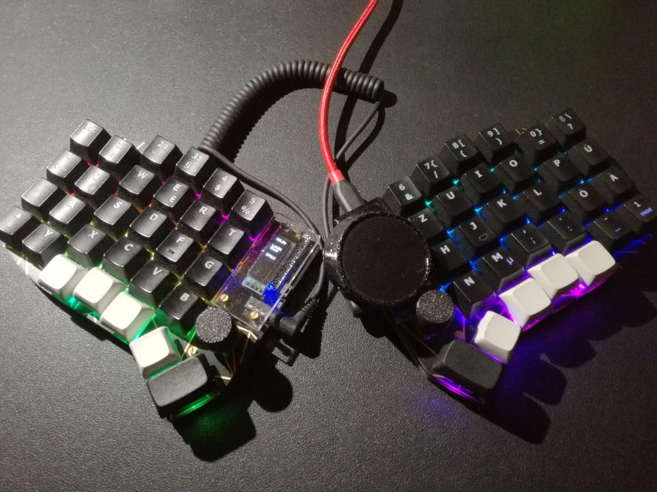
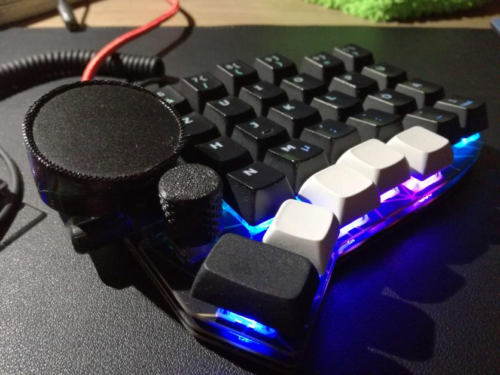
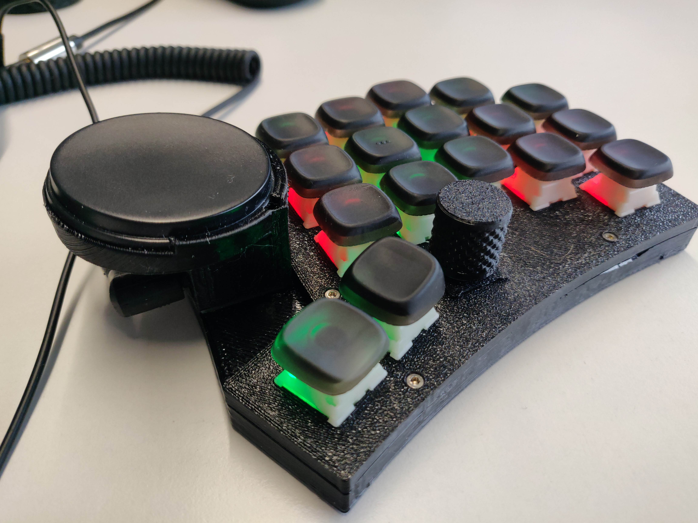
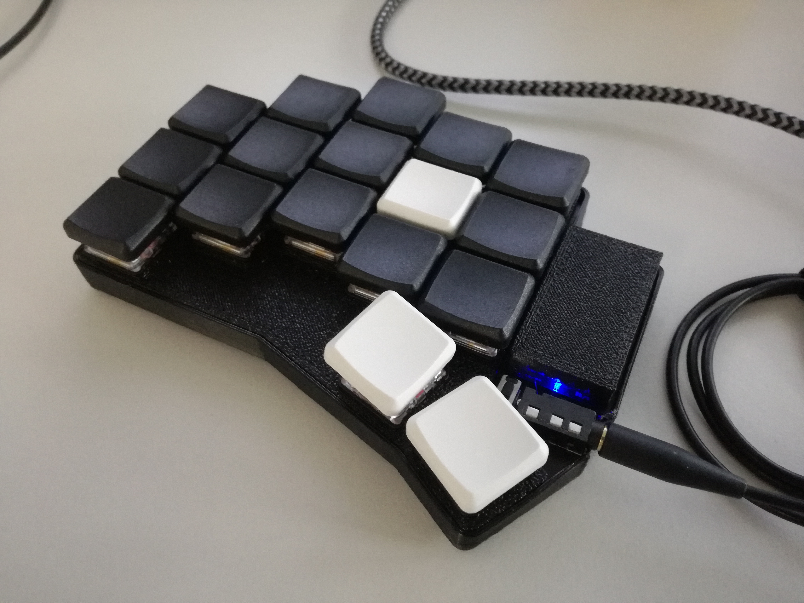

# my-mechanical-keyboard-journey

## GlidePoint Cirque Trackpad TM040040 on Kimiko

- stl and step can be found in [`things/kimiko-cirque-adapter`](./things/kimiko-cirque-adapter)





## Custom handwired sweep like keyboard

- 3d printed
- 34 key design + rotary encoders + pimoroni trackball
- handwired using [MxLEDBit Single Switch PCB](https://github.com/swanmatch/MxLEDBitPCB/blob/master/readme_en.md)
- use of pro micro pcb from the same [repo](https://github.com/swanmatch/MxLEDBitPCB/blob/master/readme_en.md)
- things can be found in [`things/custom-sweep`](./things/custom-sweep)
- design files on onshape [public onshape link](https://cad.onshape.com/documents/424fdc21f81f4ae673cb2934/w/4a53a51713ce64dab7d5f05e/e/8677036886771046333230f8?renderMode=0&uiState=63f49877699cc5590466ace6)


## Custom handwired sweep like keyboard

- improved version of [previous version](#custom-handwired-sweep-like-keyboard)
- 3d printed
- 34 key design + rotary encoders + Cirque Trackpad (TM040040)
- resin printed keycaps [KLP-Lame](https://github.com/braindefender/KLP-Lame-Keycaps/)
- handwired using [MxLEDBit Single Switch PCB](https://github.com/swanmatch/MxLEDBitPCB/blob/master/readme_en.md)
- use of pro micro pcb from the same [repo](https://github.com/swanmatch/MxLEDBitPCB/blob/master/readme_en.md)
- things can be found in [`things/custom-sweep-improved`](./things/custom-sweep-improved)
- design files on onshape [public onshape link](https://cad.onshape.com/documents/c39efbb0285907792fbd659b/w/f5a2fc229ac2faaccfa66b6b/e/30fdf6b4c4e752c1efd029ab?renderMode=0&uiState=675ab7a0961883296693085c)



## case for ferris sweep (ben vallack version)

- this is a snap in case design for the [Ferris-Sweep-Tweaked](https://github.com/benvallack/Ferris-Sweep-Tweaked) by benvallack
- it consists of a bottom case and a top plate
- the design is snap in, so that the top plate snaps in the bottom case and secures the pcb in the case
- things can be found in [`things/sweep-compact-case`](./things/sweep-compact-case)
- design files on onshape [public onshape link](https://cad.onshape.com/documents/58076ce6daae6aa7e601afe5/w/8ac8fbba64cdb73ea89b6b47/e/ebecfc0846432d70f97c4f8f?renderMode=0&uiState=63f49d55c79cef41a1f484f2)
- it also uses a 3d printed cap for the mcu, the stl can be found [here](./things/puchi-cap-plain.stl)




## Bento macro pad remix

Remix of [Bento Mechanical Keyboard Macropad](https://www.printables.com/model/451164-bento-mechanical-keyboard-macropad) with a custom bottom plate.

### Wiring

- handwired using [MxLEDBit Single Switch PCB](https://github.com/swanmatch/MxLEDBitPCB/blob/master/readme_en.md)
- using [KB2040](https://www.adafruit.com/product/5302) as MCU


```json
"cols": ["B3", "B2", "B6"],
"rows": ["D7", "E6"]
```

- cols:
  - wire 1 col to MI
  - wire 2 col to MO
  - wire 3 col to D10
- rows:
  - wire 1 row to 6
  - wire 2 row to 7
- compare with [KB2040 pinout](https://cdn-learn.adafruit.com/assets/assets/000/106/984/medium800/adafruit_products_Adafruit_KB2040_Pinout.png?1638564074)

- [ ] add image of wiring

### STLs

can be found in [./things/bento-remix/](./things/bento-remix/)

### flashing

```bash
make muellerbernd/bento/rev1:default:uf2-split-right
# or
qmk flash -kb muellerbernd/bento/rev1 -km default
```

# QMK

- setup my qmk fork as qmk home

```bash
qmk setup -H ~/Desktop/GithubProjects/my-mechanical-keyboard-journey/qmk_firmware
```

## flashing

```bash
# custom handwired sweep like
make muellerbernd/sweep:bernd-kb2040:uf2-split-right
make muellerbernd/sweep:bernd:avrdude-split-left

# custom handwired skeletyls
make muellerbernd/skeletyl:bernd:avrdude-split-left

# kimiko
make muellerbernd/kimiko/rev1:bernd:dfu-split-left

# ferris sweep
make muellerbernd/ferris/sweep:bernd:dfu-split-right

# handwired sweep
qmk flash -kb muellerbernd/sweep -km bernd-kb2040 -bl uf2-split-left

# handwired sweep with Cirque Trackpad
make muellerbernd/sweep:bernd-kb2040-cirque:uf2-split-right
```
